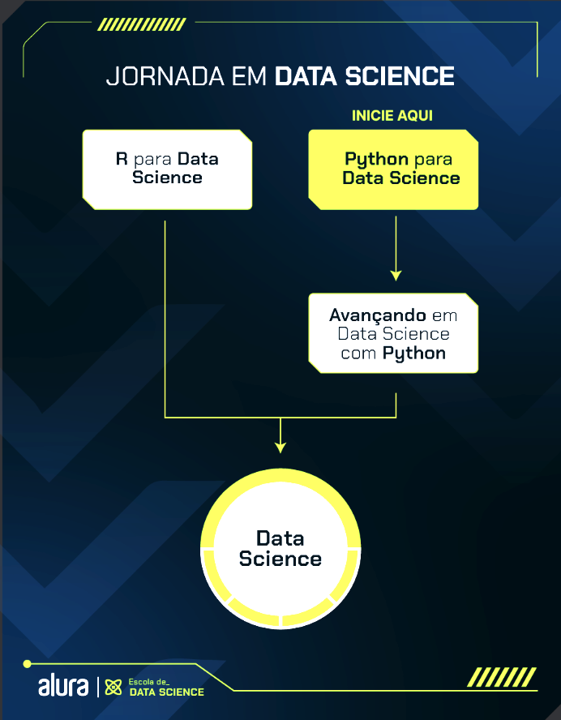

# 🚀 Jornada em Data Science com Python

<p align="center">
  
</p>

<p align="center">
  
  
  
  
</p>

---

## 📌 Sobre este repositório

Este é meu repositório de estudos da trilha [Data Science com Python da Alura](https://cursos.alura.com.br/app/learning-guide/alura/data-science-python).

Aqui registro notebooks, exercícios, anotações e projetos desenvolvidos durante a formação. A proposta é acompanhar a evolução desde os fundamentos de Python até a exploração, visualização e modelagem de dados.

## 🎯 Objetivos de aprendizagem

Ao longo da trilha, o foco é aprender a:

- programar em Python com boas práticas e raciocínio lógico;
- importar, organizar, limpar e transformar dados;
- analisar dados usando NumPy e Pandas;
- criar visualizações para identificar padrões e comunicar resultados;
- aplicar conceitos de estatística e análise exploratória;
- conhecer o fluxo inicial de Machine Learning com Scikit-Learn;
- transformar análises em projetos reproduzíveis e compreensíveis.

## 🗺️ Conteúdos da trilha

| Etapa | Principais competências | Status |
| --- | --- | :---: |
| **Python para Data Science** | Sintaxe, tipos de dados, condicionais, laços, coleções, funções, comprehensions, exceções e módulos | Em andamento |
| **Manipulação e análise de dados** | NumPy, Pandas, leitura de dados, limpeza, filtros, agrupamentos, agregações e junções | Planejada |
| **Visualização de dados** | Matplotlib, Seaborn, gráficos estatísticos, personalização e storytelling | Planejada |
| **Estatística e análise exploratória** | Medidas descritivas, dispersão, probabilidade, inferência e EDA | Planejada |
| **Introdução a Machine Learning** | Preparação de dados, regressão, classificação e métricas de avaliação com Scikit-Learn | Planejada |

> O conteúdo é atualizado à medida que novos cursos e atividades da trilha são concluídos.

## 🧰 Tecnologias e ferramentas

| Ferramenta | Uso previsto |
| :--- | :--- |
| **Python 3.11+** | Linguagem principal dos estudos |
| **Jupyter Notebook** | Experimentação, explicação e execução das análises |
| **NumPy e Pandas** | Computação numérica e manipulação de dados |
| **Matplotlib e Seaborn** | Criação e interpretação de visualizações |
| **Scikit-Learn** | Introdução a modelos e avaliação de Machine Learning |
| **Git e GitHub** | Versionamento e documentação da jornada |

## 🚀 Como executar

1. Clone o repositório:
   ```bash
   git clone https://github.com/thiagorobade/data-science-python.git
   cd data-science-python
   ```

2. Crie e ative um ambiente virtual:
   ```bash
   python -m venv venv
   # Windows PowerShell
   .\venv\Scripts\Activate.ps1
   # Linux/macOS
   source venv/bin/activate
   ```

3. Instale o Jupyter (e as bibliotecas usadas no notebook, quando necessário):
   ```bash
   python -m pip install jupyter numpy pandas matplotlib seaborn scikit-learn
   ```

4. Inicie o Jupyter e abra o notebook desejado:
   ```bash
   jupyter lab
   ```

> As dependências podem ser ajustadas conforme o conteúdo estudado. Antes de executar um notebook, confira as células de importação e instale apenas o que for necessário.

## 👨‍💻 Autor

Desenvolvido por **Thiago Robade** durante a jornada de estudos em Data Science. ✨

[](https://github.com/thiagorobade)
